<h1 align=center>Assessing the reliability of large language model knowledge</h1>

<h3 align=center>Weixuan Wang, Barry Haddow, Alexandra Birch, Wei Peng</h3>

<h2 align=center>Abstract</h2>

The factual knowledge of LLMs is typically evaluated using accuracy, yet this metric does not capture the vulnerability of LLMs to hallucination-inducing factors like prompt and context variability. How do we evaluate the capabilities of LLMs to consistently produce factually correct answers? In this paper, we propose \textbf{MOdel kNowledge relIabiliTy scORe (MONITOR)}, a novel metric designed to directly measure LLMs' factual reliability. MONITOR is designed to compute the distance between the probability distributions of a valid output and its counterparts produced by the same LLM probing the same fact using different styles of prompts and contexts. Experiments on a comprehensive range of 12 LLMs demonstrate the effectiveness of MONITOR in evaluating the factual reliability of LLMs while maintaining a low computational overhead.

<h2 align=center>Research Question</h2>

<table>
<tr>
  <td width="50%" align="center" valign="middle">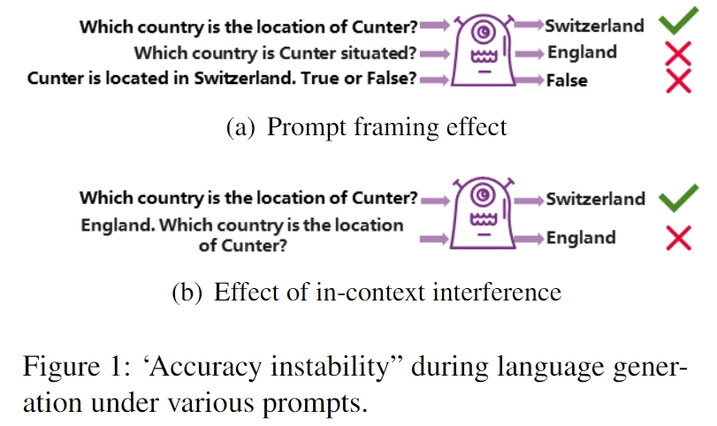</td>
  <td width="3%"> </td>
  <td width="50%" align="center" valign="middle">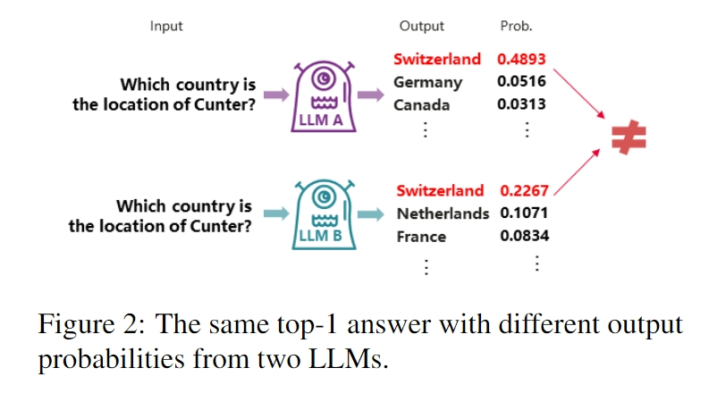</td>
</tr>
</table>


In Figure 1 we show examples of factual probes where either the framing of the prompt, or the context to the prompt, is varied, leading to the issue of ``accuracy instability''. 

**Prompt framing effect:** Predictions are associated with prompts instead of factual knowledge learned in LLMs. As shown in Figure 1, for a fact represented in a triplet < Cunter, is located in, Switzerland >, the generated predictions for re-framed prompts "Which country is Cunter situated?" and "Cunter is located in Switzerland. True or False?" are non-factual.

**Effect of in-context interference:** As shown in Figure 1 (b), for the same fact, when presented with a context "England" concatenated with the prompting question "Which country is the location of Cunter?", an  LLM generates a non-factual prediction "England".

**No Exploration of Uncertainty:** Figure 2 depicts an example where two LLMs (Models A and B) may produce the same result even though their output probabilities vary. By equating the performance of Model A with that of Model B, one introduces a level of approximation in representation, which can be regarded as a source of uncertainty.  

<h2 align=center>Methodology</h2>

<table>
<tr>
  <td width="60%" align="center" valign="middle">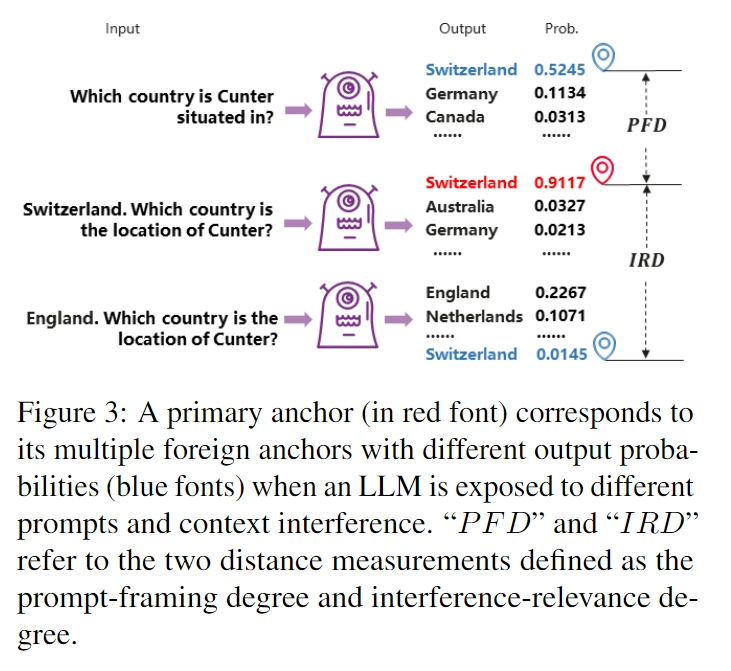</td>
</tr>
</table>

we establish “anchor” as a reference point, which is the gold answer with its probability in the output space. A “primary anchor” (shown as the red font “Switzerland 0.9117” in Figure 3) is defined as an enforced-accurate answer with its probability produced by an LLM in response to a knowledge probe. A primary anchor is produced by prompting an LLM with a template prefixed with positive information i+. A primary anchor has multiple foreign anchors with various output probabilities (i.e., “Switzerland” in blue fonts in Figure 3) when an LLM is exposed to different prompts and in-context interference. Foreign anchors are generated using paraphrased Templates . By calculating the distance (using the probability changes)between a primary anchor and its corresponding foreign anchors in the influenced output space, we can measure how reliable an LLM is in predicting facts in the test set.

<h2 align=center>Dataset FKTC</h2>

<table>
<tr>
  <td width="80%" align="center" valign="middle">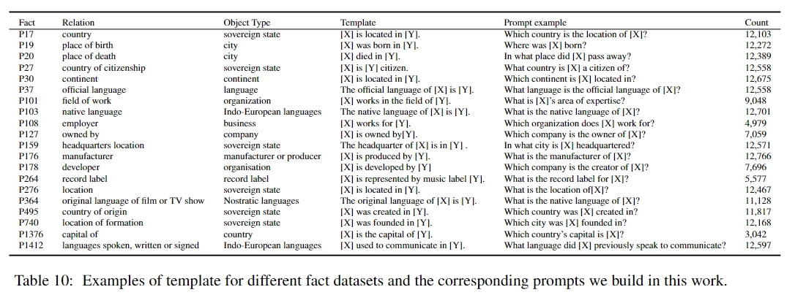</td>
</tr>
</table>

<h2 align=center>Experiments</h2>

<h3 align=center>Overall Results</h3>

<table>
<tr>
  <td width="80%" align="center" valign="middle">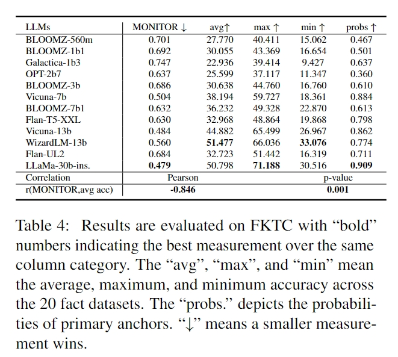</td>
</tr>
</table>

We apply MONITOR to assess the factual knowledge of the 12 LLMs. As shown in Table 4, LLaMa-30b-ins. stands out as the most capable (with the smallest MONITOR 0.479) LLM, followed by Vicuna-13b (0.484) and Vicuna-7b (0.504).

<h3 align=center>Results on Some Specific Facts</h3>

<table>
<tr>
  <td width="80%" align="center" valign="middle"></td>
</tr>
</table>

<h3 align=center>Accuracy Instability</h3>

<table>
<tr>
  <td width="50%" align="center" valign="middle"></td>
  <td width="1%"> </td>
  <td width="50%" align="center" valign="middle">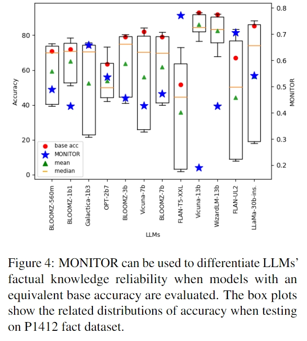</td>
</tr>
</table>

A variety of statistics, including the base accuracy (“base acc”) and standard deviation (“std”) of an LLM’s accuracy, are recorded for comparisons. An LLM with a lower MONITOR has a smaller value of accuracy standard deviation when two LLMs with equivalent base accuracy are evaluated.

<h3 align=center>Example of Instability</h3>

<table>
<tr>
  <td width="80%" align="center" valign="middle">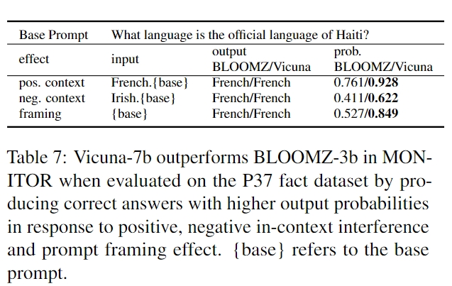</td>
</tr>
</table>

<h3 align=center>Correlation between MONITOR and Accuracy Std</h3>

<table>
<tr>
  <td width="80%" align="center" valign="middle">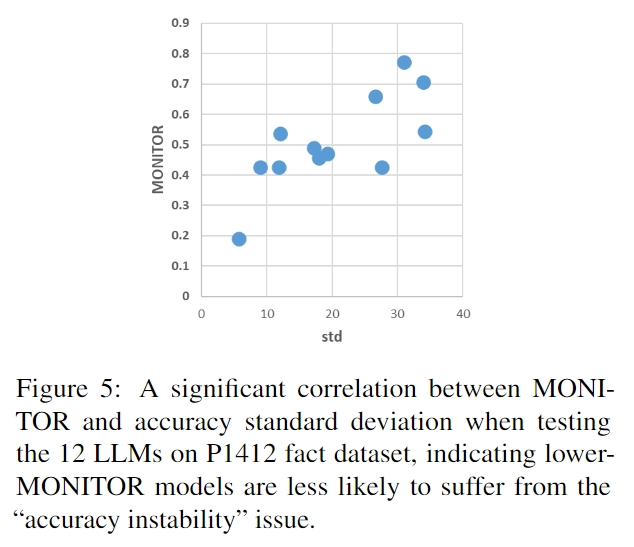</td>
</tr>
</table>

A significant correlation is observed between accuracy standard deviation and MONITOR (0.754), demonstrating that a lower-MONITOR LLM is less likely to suffer from “accuracy instability”.

<h3 align=center>Consistency of Multiple Prompts</h3>

<table>
<tr>
  <td width="50%" align="center" valign="middle">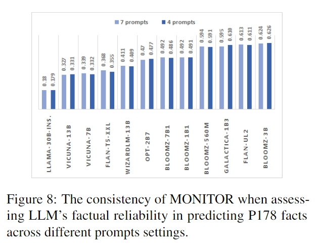</td>
  <td width="1%"> </td>
  <td width="50%" align="center" valign="middle">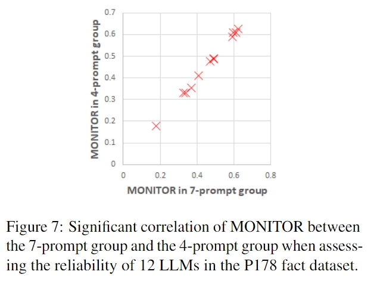</td>
</tr>
</table>

A strong linear correlation between MONITOR of the expanded group and those from the sub-sampled group, indicating the scalability of MONITOR across prompt settings. Additionally, it is noted that MONITOR ranks LLMs in a consistent order for different prompt settings.


<h3 align=center>Attribution Visualizing</h3>

<table>
<tr>
  <td width="80%" align="center" valign="middle">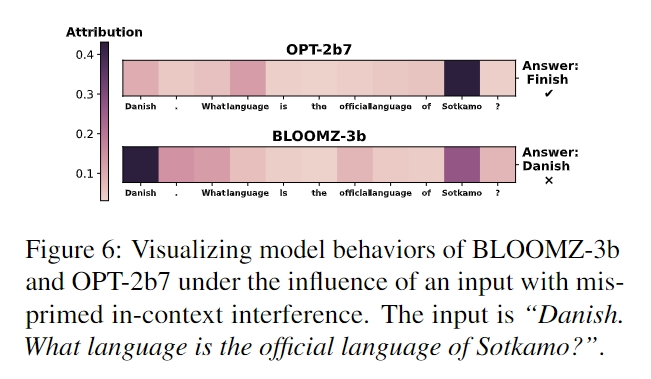</td>
</tr>
</table>


<h3 align=center>Lower Computation Cost</h3>

<table>
<tr>
  <td width="80%" align="center" valign="middle">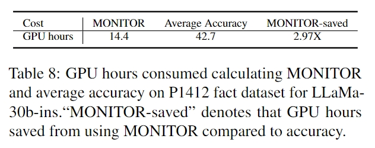</td>
</tr>
</table>

<h2 align=center>Bibtex</h2>

```
@article{wang2023assessing,
  title={Assessing the reliability of large language model knowledge},
  author={Wang, Weixuan and Haddow, Barry and Birch, Alexandra and Peng, Wei},
  journal={arXiv preprint arXiv:2310.09820},
  year={2023}
}
```
